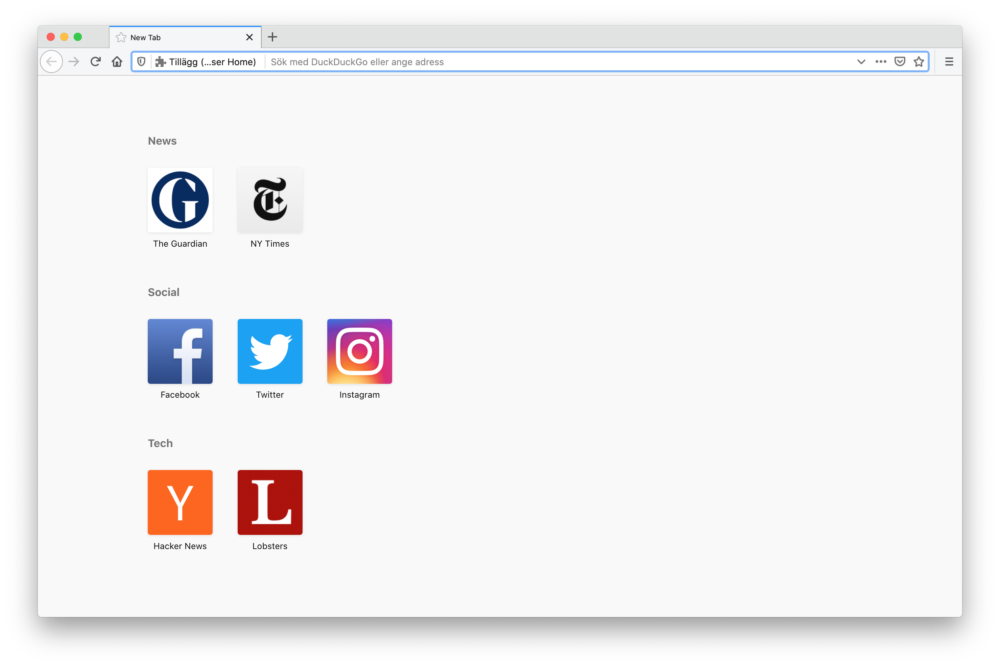

# Browser Home

Browser extension for viewing your bookmarks when opening a new window or tab



## Install

Firefox: https://addons.mozilla.org/firefox/addon/browser-home/
Chrome: https://chrome.google.com/webstore/detail/hlgpkiebhkajphebfbjjodcdnkecgpdd/

## Contribute

### Spinning up environment

**1. Install the dependencies**

```bash
npm install
```

**2. Precache icons from blacklisted websites**

```bash
npm run precache-icons
```

**3. Start building**

```bash
npm start
```

**4. Load addon into browser**

Start Firefox and enter `about:debugging` into the address bar. Load `public/manifest.json` as a temporary addon.
If developing in Chrome, rename `public/chrome.manifest.json` to `public/manifest.json`.
